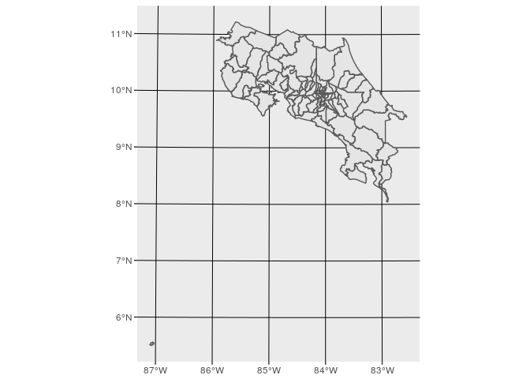
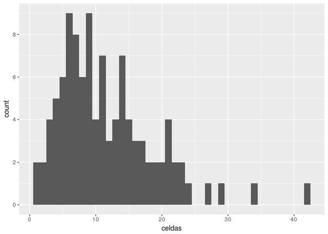

Preparación de datos para visualizaciones de GCMs - cantones y distritos
================
Guillermo A. Durán

Preparación de los datos para visualización.

Paquetes utilizados

``` r
library(sf)
```

    ## Linking to GEOS 3.5.1, GDAL 2.2.1, proj.4 4.9.3

``` r
library(tidyverse)
```

    ## ── Attaching packages ─────────────────────────────────────────────────────────────────────────────────────────────── tidyverse 1.2.1 ──

    ## ✔ ggplot2 2.2.1.9000     ✔ purrr   0.2.4     
    ## ✔ tibble  1.4.2          ✔ dplyr   0.7.4     
    ## ✔ tidyr   0.8.0          ✔ stringr 1.3.0     
    ## ✔ readr   1.1.1          ✔ forcats 0.3.0

    ## ── Conflicts ────────────────────────────────────────────────────────────────────────────────────────────────── tidyverse_conflicts() ──
    ## ✖ dplyr::filter() masks stats::filter()
    ## ✖ dplyr::lag()    masks stats::lag()
    ## ✖ dplyr::vars()   masks ggplot2::vars()

``` r
library(rgdal)
```

    ## Loading required package: sp

    ## rgdal: version: 1.2-18, (SVN revision 718)
    ##  Geospatial Data Abstraction Library extensions to R successfully loaded
    ##  Loaded GDAL runtime: GDAL 2.2.1, released 2017/06/23
    ##  Path to GDAL shared files: /usr/share/gdal/2.2
    ##  GDAL binary built with GEOS: TRUE 
    ##  Loaded PROJ.4 runtime: Rel. 4.9.3, 15 August 2016, [PJ_VERSION: 493]
    ##  Path to PROJ.4 shared files: (autodetected)
    ##  Linking to sp version: 1.2-7

``` r
library(scales)
```

    ## 
    ## Attaching package: 'scales'

    ## The following object is masked from 'package:purrr':
    ## 
    ##     discard

    ## The following object is masked from 'package:readr':
    ## 
    ##     col_factor

Leer datos de WFS con cantones y distritos del WFS del SNIT escala 1:5000 usando el paquete rgdal

URL del WFS del SNIT con datos escala 1:5000

``` r
dsn <- "WFS:http://geos.snitcr.go.cr/be/IGN_25/wfs?"
```

Lista de todas las capas dentro de ese WFS

``` r
ogrListLayers(dsn)
```

    ## Warning in normalizePath(dsn): path[1]="WFS:http://geos.snitcr.go.cr/be/
    ## IGN_25/wfs?": No such file or directory

    ##  [1] "IGN_25:accidentescosterosmarinos_25k" 
    ##  [2] "IGN_25:caucedrenaje_25k"              
    ##  [3] "IGN_25:guia_hojas_25mil"              
    ##  [4] "IGN_25:contorno_25k"                  
    ##  [5] "IGN_25:RE_120106"                     
    ##  [6] "IGN_25:cuerposdeagua_25k"             
    ##  [7] "IGN_25:RE_120101"                     
    ##  [8] "IGN_25:RE_120102"                     
    ##  [9] "IGN_25:RE_120103"                     
    ## [10] "IGN_25:ec140101_25k"                  
    ## [11] "IGN_25:edificacionesprominentes_25k"  
    ## [12] "IGN_25:infraestructuraferroviaria_25k"
    ## [13] "IGN_25:infraestructuravial_25k"       
    ## [14] "IGN_25:infraestructuravial2_25k"      
    ## [15] "IGN_25:limitecantonal_25k"            
    ## [16] "IGN_25:limitedistrital_25k"           
    ## [17] "IGN_25:limiteprovincial_25k"          
    ## [18] "IGN_25:RE_120104"                     
    ## [19] "IGN_25:muelle_25k"                    
    ## [20] "IGN_25:obraspublicas1_25k"            
    ## [21] "IGN_25:obraspublicas2_25k"            
    ## [22] "IGN_25:obraspublicas3_25k"            
    ## [23] "IGN_25:otroscuerposdeagua1_25k"       
    ## [24] "IGN_25:otroscuerposdeagua2_25k"       
    ## [25] "IGN_25:pistadeaterrizaje_25k"         
    ## [26] "IGN_25:transporteferroviario_25k"     
    ## [27] "IGN_25:transporteterrestre_25k"       
    ## [28] "IGN_25:areasespecificas_25k"          
    ## attr(,"driver")
    ## [1] "WFS"
    ## attr(,"nlayers")
    ## [1] 28

Descarga y creación de SF para distritos y cantones

``` r
distritos <- st_read(dsn, "IGN_25:limitedistrital_25k")
```

    ## Reading layer `IGN_25:limitedistrital_25k' from data source `WFS:http://geos.snitcr.go.cr/be/IGN_25/wfs?' using driver `WFS'
    ## Simple feature collection with 487 features and 21 fields
    ## geometry type:  MULTIPOLYGON
    ## dimension:      XY
    ## bbox:           xmin: 156152 ymin: 608833.8 xmax: 658879.5 ymax: 1241118
    ## epsg (SRID):    5367
    ## proj4string:    +proj=tmerc +lat_0=0 +lon_0=-84 +k=0.9999 +x_0=500000 +y_0=0 +ellps=WGS84 +towgs84=0,0,0,0,0,0,0 +units=m +no_defs

``` r
cantones <- st_read(dsn, "IGN_25:limitecantonal_25k")
```

    ## Reading layer `IGN_25:limitecantonal_25k' from data source `WFS:http://geos.snitcr.go.cr/be/IGN_25/wfs?' using driver `WFS'
    ## Simple feature collection with 81 features and 16 fields
    ## geometry type:  MULTIPOLYGON
    ## dimension:      XY
    ## bbox:           xmin: 156152 ymin: 608833.8 xmax: 658879.5 ymax: 1241118
    ## epsg (SRID):    5367
    ## proj4string:    +proj=tmerc +lat_0=0 +lon_0=-84 +k=0.9999 +x_0=500000 +y_0=0 +ellps=WGS84 +towgs84=0,0,0,0,0,0,0 +units=m +no_defs

Graficar cantones para corroborar que datos se hayan descargado bien

``` r
ggplot() + geom_sf(data = cantones)
```



A pesar de los pasos anteriores, se decidió hacer la selección usando QGIS para únicamente seleccionar los cantones con casi la totalidad del área cubierta por las celdas ("select by location" y ajuste visual). Ahora cargar json con distritos y cantones seleccionados además de celdas con datos

``` r
distritos <- st_read("SIG/DistritosChorotega.geojson")
```

    ## Reading layer `DistritosChorotega' from data source `/home/cigefi/Guillermo/ClimaVis_CIGEFI/SIG/DistritosChorotega.geojson' using driver `GeoJSON'
    ## Simple feature collection with 112 features and 20 fields
    ## geometry type:  MULTIPOLYGON
    ## dimension:      XY
    ## bbox:           xmin: -85.94991 ymin: 9.558551 xmax: -84.45147 ymax: 11.21964
    ## epsg (SRID):    4326
    ## proj4string:    +proj=longlat +datum=WGS84 +no_defs

``` r
cantones <- st_read("SIG/CantonesChorotega.geojson")
```

    ## Reading layer `CantonesChorotega' from data source `/home/cigefi/Guillermo/ClimaVis_CIGEFI/SIG/CantonesChorotega.geojson' using driver `GeoJSON'
    ## Simple feature collection with 19 features and 15 fields
    ## geometry type:  MULTIPOLYGON
    ## dimension:      XY
    ## bbox:           xmin: -87.10189 ymin: 5.49856 xmax: -84.45147 ymax: 11.21964
    ## epsg (SRID):    4326
    ## proj4string:    +proj=longlat +datum=WGS84 +no_defs

``` r
celdas <- st_read("SIG/CeldasUbicaciones.geojson")
```

    ## Reading layer `CeldasUbicaciones' from data source `/home/cigefi/Guillermo/ClimaVis_CIGEFI/SIG/CeldasUbicaciones.geojson' using driver `GeoJSON'
    ## Simple feature collection with 614 features and 7 fields
    ## geometry type:  MULTIPOLYGON
    ## dimension:      XY
    ## bbox:           xmin: -85.84772 ymin: 9.552155 xmax: -84.49772 ymax: 11.20215
    ## epsg (SRID):    4326
    ## proj4string:    +proj=longlat +datum=WGS84 +no_defs

Seleccionar celdas por cada cantón

``` r
seleccionCantones <- st_intersection(cantones, celdas) %>% 
  select(canton, id)
```

    ## although coordinates are longitude/latitude, st_intersection assumes that they are planar

    ## Warning: attribute variables are assumed to be spatially constant
    ## throughout all geometries

Contar celdas por cada cantón

``` r
cant_summ <- seleccionCantones %>% group_by(canton) %>% summarise(n())
cant_summ
```

    ## Simple feature collection with 19 features and 2 fields
    ## geometry type:  GEOMETRY
    ## dimension:      XY
    ## bbox:           xmin: -85.84772 ymin: 9.602155 xmax: -84.49772 ymax: 11.20215
    ## epsg (SRID):    4326
    ## proj4string:    +proj=longlat +datum=WGS84 +no_defs
    ## # A tibble: 19 x 3
    ##    canton        `n()`                                            geometry
    ##    <fct>         <int>                                      <GEOMETRY [°]>
    ##  1 ABANGARES        33 POLYGON ((-85.04772 10.1599, -85.04778 10.1599, -8…
    ##  2 BAGACES          61 POLYGON ((-85.24732 10.25215, -85.24753 10.25181, …
    ##  3 CAÑAS            40 POLYGON ((-84.95815 10.35215, -84.95816 10.3521, -…
    ##  4 CARRILLO         36 POLYGON ((-85.49772 10.34494, -85.49798 10.34485, …
    ##  5 ESPARZA          14 POLYGON ((-84.68911 9.902155, -84.68909 9.90214, -…
    ##  6 GUATUSO          41 POLYGON ((-84.84772 10.56198, -84.84812 10.56188, …
    ##  7 HOJANCHA         16 POLYGON ((-85.34772 10.0447, -85.34491 10.04429, -…
    ##  8 LA CRUZ          54 POLYGON ((-85.58046 10.85215, -85.58048 10.85215, …
    ##  9 LIBERIA          67 MULTIPOLYGON (((-85.66551 10.80215, -85.66549 10.8…
    ## 10 LOS CHILES       52 POLYGON ((-84.84772 10.81418, -84.84773 10.81417, …
    ## 11 MONTES DE ORO    17 POLYGON ((-84.80846 10.10215, -84.80852 10.10205, …
    ## 12 NANDAYURE        34 POLYGON ((-85.44772 9.862349, -85.44775 9.862351, …
    ## 13 NICOYA           60 MULTIPOLYGON (((-85.24772 10.24396, -85.24771 10.2…
    ## 14 OROTINA          11 POLYGON ((-84.54772 9.848025, -84.54775 9.848006, …
    ## 15 PUNTARENAS       73 MULTIPOLYGON (((-84.69772 9.992273, -84.69802 9.99…
    ## 16 SAN MATEO         8 POLYGON ((-84.54772 9.922929, -84.54772 9.922903, …
    ## 17 SANTA CRUZ       58 POLYGON ((-85.66413 10.00215, -85.66422 10.00208, …
    ## 18 TILARAN          32 POLYGON ((-84.76707 10.35215, -84.76709 10.35213, …
    ## 19 UPALA            68 POLYGON ((-84.99925 10.70215, -84.99944 10.7, -84.…

Ojo que hay "suficiente" cantidad de celdas por cada cantón. Ahora a revisar por distrito.

``` r
seleccionDistritos <- st_intersection(distritos,celdas) %>% 
  select(nombre, nom_cant, id)
```

    ## although coordinates are longitude/latitude, st_intersection assumes that they are planar

    ## Warning: attribute variables are assumed to be spatially constant
    ## throughout all geometries

Contar celdas por cada distrito

``` r
dist_summ <- seleccionDistritos %>% group_by(nombre, nom_cant) %>% summarise("celdas" = n()) %>% arrange(celdas) %>% select(nombre, nom_cant, celdas)

dist_summ
```

    ## Simple feature collection with 107 features and 3 fields
    ## geometry type:  GEOMETRY
    ## dimension:      XY
    ## bbox:           xmin: -85.84772 ymin: 9.602155 xmax: -84.49772 ymax: 11.20215
    ## epsg (SRID):    4326
    ## proj4string:    +proj=longlat +datum=WGS84 +no_defs
    ## # A tibble: 107 x 4
    ## # Groups:   nombre [105]
    ##    nombre          nom_cant   celdas                              geometry
    ##    <fct>           <fct>       <int>                         <POLYGON [°]>
    ##  1 CHACARITA       Puntarenas      1 ((-84.77158 9.995557, -84.77136 9.99…
    ##  2 DESMONTE        San Mateo       1 ((-84.49772 9.942407, -84.49788 9.94…
    ##  3 EL ROBLE        Puntarenas      2 ((-84.73227 9.995191, -84.73142 9.99…
    ##  4 HACIENDA VIEJA  Orotina         2 ((-84.50119 9.902155, -84.50127 9.90…
    ##  5 ESPÍRITU SANTO  Esparza         3 ((-84.69772 9.975167, -84.69796 9.97…
    ##  6 HUACAS          Hojancha        3 ((-85.34772 10.0447, -85.34491 10.04…
    ##  7 LABRADOR        San Mateo       3 ((-84.64772 9.906791, -84.64773 9.90…
    ##  8 SAN JUAN GRANDE Esparza         3 ((-84.6558 9.952155, -84.65586 9.952…
    ##  9 CARMONA         Nandayure       4 ((-85.24772 9.972729, -85.24782 9.97…
    ## 10 EL MASTATE      Orotina         4 ((-84.54772 9.922297, -84.54772 9.92…
    ## # ... with 97 more rows

Graficarlo en histograma

``` r
test <- seleccionDistritos %>% group_by(nombre) %>% summarise("celdas" = n())
ggplot(test, aes(celdas)) + geom_histogram(binwidth = 1) + scale_y_continuous(breaks= pretty_breaks())
```



Guardar tablas de seleccion

``` r
write_csv(seleccionCantones, "seleccionCantones.csv")
write_csv(seleccionDistritos, "seleccionDistritos.csv")
```

Crear listas de cantones y distritos por canton:

``` r
cant_summ$canton <- str_to_title(as.character(cant_summ$canton))
dist_summ$nombre <- str_to_title(as.character(dist_summ$nombre))
dist_summ <- data.frame(distrito = dist_summ$nombre, canton = dist_summ$nom_cant)
```

Guardar tabla con distritos por cantón:

``` r
write_csv(dist_summ, "distritos_cantones.csv")
```

Creación de tablas con valores anuales para cada distrito
=========================================================

Cargar datos de GCMs crudos

``` r
tbl_month <- readRDS("mensual_CIGEFI_raw.rds")
```

Union de tablas para agregar indicador de celdas a datos mensuales

``` r
tbl_month_id <- tbl_month %>% left_join(celdas, by = c("Latitude" = "Lon", "Longitude" = "Lat")) #ojo que la Lat y Lon de los datos originales están invertidos y siguen invertidos
tbl_month_id <- data.frame(Year = tbl_month_id$Year, 
                           Month = tbl_month_id$Month, 
                           Model = tbl_month_id$Model, 
                           Scenario = tbl_month_id$Scenario, 
                           tas_month = tbl_month_id$tas_month,
                           pr_month = tbl_month_id$pr_month, 
                           id = tbl_month_id$id)
```

Preparación de tabla con promedios anuales para cada distrito. Ojo que acá hay que primero promediar la lluvia por mes y luego sumarla a años.

``` r
valores_distritos <- tbl_month_id %>% 
  left_join(seleccionDistritos, by = "id") %>% 
  group_by(Year, Month, Model, Scenario, nombre) %>% 
  summarise(t_mean = mean(tas_month), p_mean = mean(pr_month)) %>% 
  group_by(Year, Model, Scenario, nombre) %>% 
  summarise(t_mean_y = mean(t_mean), p_y = sum(p_mean))
```

Arreglar nombres y salvar tabla

``` r
valores_distritos$nombre <- str_to_title(as.character(valores_distritos$nombre))
valores_distritos <- rename(valores_distritos, distrito = nombre)

write_csv(valores_distritos, "val_distritos.csv")
```

Creación de tablas con valores mensuales para cada distrito
===========================================================

``` r
valores_distritos_mes <- tbl_month_id %>% 
  left_join(seleccionDistritos, by = "id") %>% 
  group_by(Year, Month, Model, Scenario, nombre) %>% 
  summarise(t_mean = mean(tas_month), p_mean = mean(pr_month))
```

Guardar tabla

``` r
valores_distritos_mes$nombre <- str_to_title(as.character(valores_distritos_mes$nombre))
valores_distritos_mes <- rename(valores_distritos_mes, distrito = nombre)
saveRDS(valores_distritos_mes, "val_distritos_mes.rds")
```
